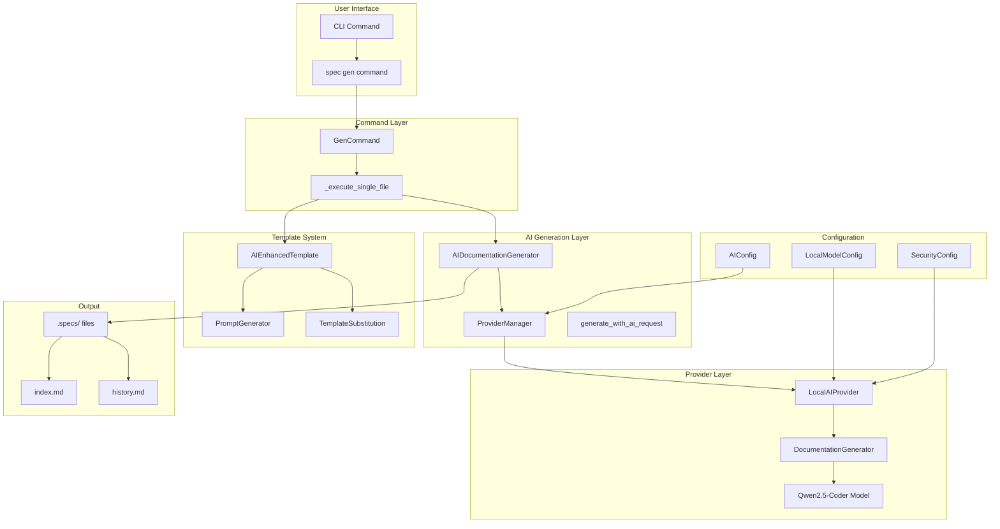
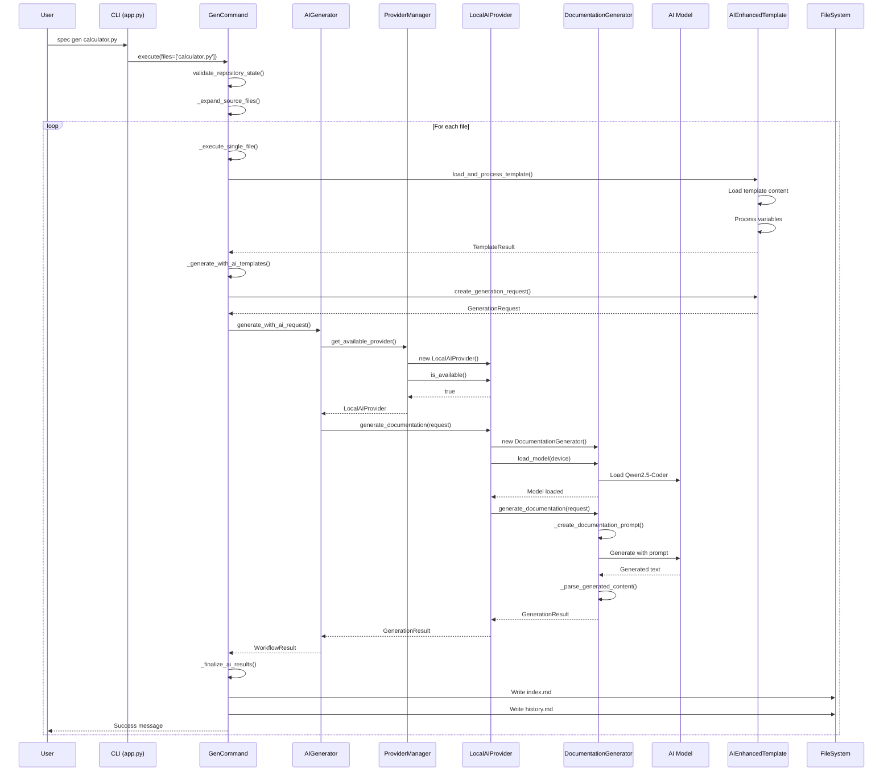
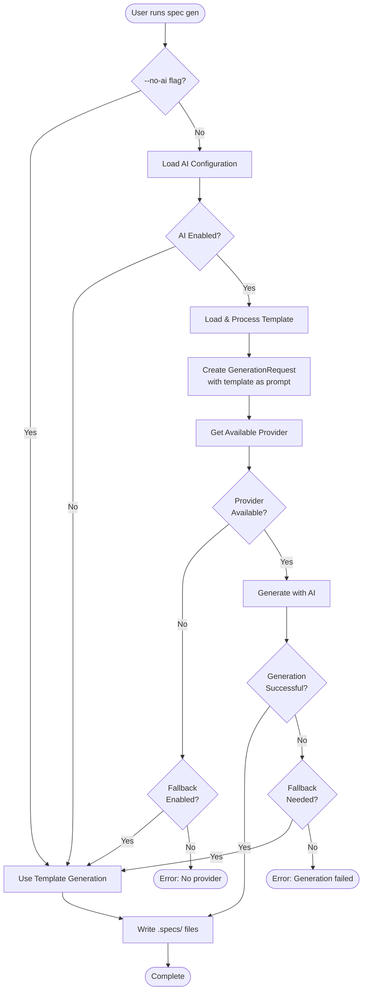
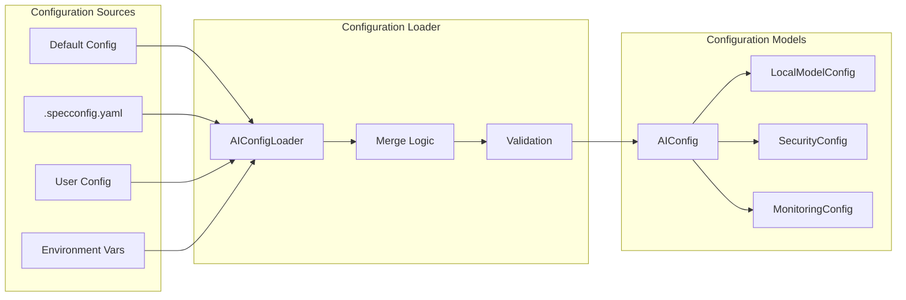
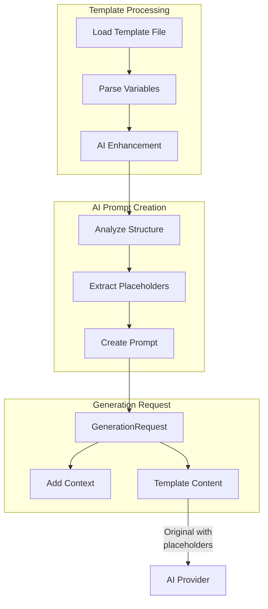
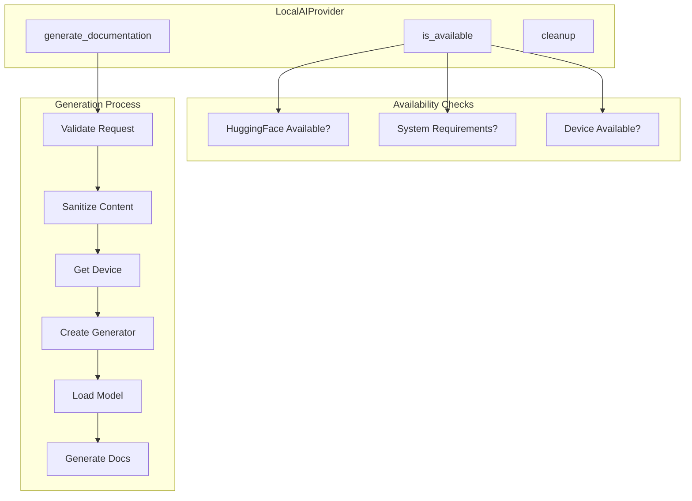

# AI System Architecture Documentation

This document provides a comprehensive overview of the AI system architecture in spec-cli, detailing the complete flow from user commands through AI generation to final output.

## Table of Contents

1. [System Overview](#system-overview)
2. [Core Components](#core-components)
3. [Execution Flow](#execution-flow)
4. [Component Details](#component-details)
5. [Configuration System](#configuration-system)
6. [Template Integration](#template-integration)
7. [Provider System](#provider-system)
8. [Troubleshooting Summary](#troubleshooting-summary)

## System Overview

The spec-cli AI system is designed as the primary documentation generation engine, with template-based fallback for reliability. The architecture follows a modular design with clear separation of concerns:

- **AI-First Approach**: AI generation is the primary method for creating documentation
- **Template Fallback**: Enhanced templates provide fallback when AI is unavailable
- **Modular Providers**: Pluggable AI provider system supporting local and future cloud providers
- **Cross-Platform Support**: Works on Windows, macOS, and Linux with platform-specific optimizations

## Core Components

### High-Level Architecture



## Execution Flow

### Complete Generation Flow



### AI Generation Decision Flow



## Component Details

### 1. Command Layer (`gen_command.py`)

The entry point for AI generation, handling:
- Command argument parsing and validation
- Repository state validation
- File expansion (directories to individual files)
- Orchestration of AI generation with template fallback

Key methods:
- `execute()`: Main command entry point
- `_execute_single_file()`: Process individual file with AI-first approach
- `_generate_with_ai_templates()`: Generate using templates as AI prompts
- `_finalize_ai_results()`: Write AI-generated content to disk

### 2. AI Generation Layer (`ai_generator.py`)

Core AI orchestration logic:
- Configuration loading and validation
- Provider selection through ProviderManager
- Request/response handling
- Fallback signaling

Key classes:
- `AIDocumentationGenerator`: Main generator coordinating AI providers
- Functions: `generate_with_ai()`, `generate_with_ai_request()`

### 3. Provider System

#### Provider Manager (`manager.py`)
Selects appropriate AI provider based on configuration:
- Checks AI enabled status
- Validates provider availability
- Returns configured provider or None

#### Local AI Provider (`local.py`)
Implements AI generation using local models:
- HuggingFace transformers integration
- Cross-platform device detection (CUDA, MPS, CPU)
- Security validation through CodeSanitizer
- Resource management and cleanup

Key features:
- Automatic device selection (GPU/CPU)
- Memory optimization with 4-bit quantization
- Platform-specific optimizations

#### Documentation Generator (`generation.py`)
Handles actual model operations:
- Model loading with caching
- Prompt creation from templates
- Text generation with configurable parameters
- Output parsing and structuring

### 4. Template System

#### AI Enhanced Template (`ai_enhanced.py`)
Bridges templates with AI generation:
- Traditional variable substitution (backward compatible)
- AI prompt structure generation
- Template validation for AI compatibility
- Creation of GenerationRequest objects

#### Prompt Generator (`prompt_generator.py`)
Converts templates to AI-friendly prompts:
- Analyzes template structure
- Extracts placeholders and sections
- Generates AI instructions

## Configuration System

### AI Configuration Structure

```yaml
ai:
  enabled: true                    # AI is core feature
  provider: "local"                # Primary provider
  local:
    model_name: "Qwen/Qwen2.5-Coder-0.5B-Instruct"
    max_tokens: 512               # Generation limit
    temperature: 0.1              # Low for consistency
    use_4bit: true               # Memory optimization
    device: "auto"               # Platform detection
    cache_enabled: true          # Model caching
  security:
    sanitize_code: true          # Security scanning
    max_file_size_kb: 100        # Size limits
    blocked_patterns:            # Sensitive data
      - "api[_-]?key"
      - "secret"
      - "password"
  monitoring:
    enabled: false               # Performance tracking
    overhead_limit_percent: 5.0  # Resource limits
  fallback_to_templates: true    # Reliability fallback
```

### Configuration Loading Flow



## Template Integration

### Template-to-AI Flow



### Template Variable Flow

The system handles two types of variables:
1. **Static Variables**: Pre-filled by the system (filename, date, path)
2. **AI Variables**: Generated by AI analysis (purpose, dependencies, API)

## Provider System

### Provider Selection Logic

```python
# Simplified provider selection
def get_available_provider():
    if not ai_config.enabled:
        return None

    if ai_config.provider == "local":
        provider = LocalAIProvider(config)
        if provider.is_available():
            return provider

    return None  # Triggers fallback
```

### Local AI Provider Architecture



## Troubleshooting Summary

Based on the investigation documented in `AI_TROUBLESHOOTING.md`, the key issues resolved were:

### 1. Dual AI System Confusion
**Problem**: Two AI systems existed - old PlaceholderAIProvider and new LocalAIProvider
**Solution**: Eliminated PlaceholderAIProvider, forced new AI system usage

### 2. AI Dependencies as Optional
**Problem**: Core AI dependencies were optional extras, causing availability issues
**Solution**: Made PyTorch and transformers core dependencies

### 3. Empty AI Generation
**Problem**: Model immediately generated EOS token without content
**Root Cause**: Complex template prompt incompatible with small 0.5B model
**Solution**: Simplified prompt format for better model compatibility

### 4. Model Loading Issues
**Problem**: Model loading code not being reached despite provider availability
**Solution**: Fixed execution flow and added proper debug tracing

### Current Architecture Status

✅ **Working Components**:
- AI configuration loading
- Provider selection (LocalAIProvider)
- Template-to-prompt conversion
- Model loading and inference
- Cross-platform device detection
- File writing to .specs/ directory

❌ **Known Limitations**:
- 0.5B model size insufficient for complex templates
- Model generates minimal content with current prompts
- Need better prompt engineering for small models

🔄 **Recommended Improvements**:
- Upgrade to larger model (1B+ parameters)
- Implement hybrid approach (pre-fill static variables)
- Optimize prompts for specific model architecture
- Add model-specific prompt templates

## Future Enhancements

1. **Cloud Provider Support**: Add OpenAI, Anthropic, Cohere providers
2. **Model Selection**: Support multiple local models with auto-selection
3. **Caching Layer**: Cache generated documentation for similar files
4. **Incremental Generation**: Only regenerate changed sections
5. **Multi-File Context**: Use project-wide context for better documentation
6. **Custom Prompts**: User-defined prompt templates per project
