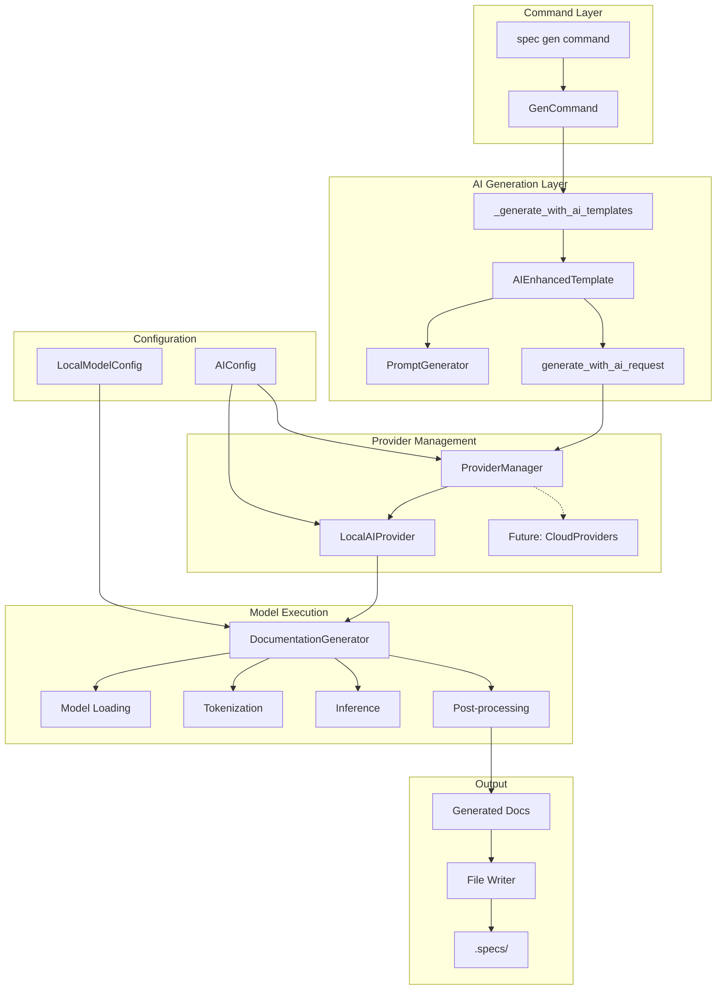
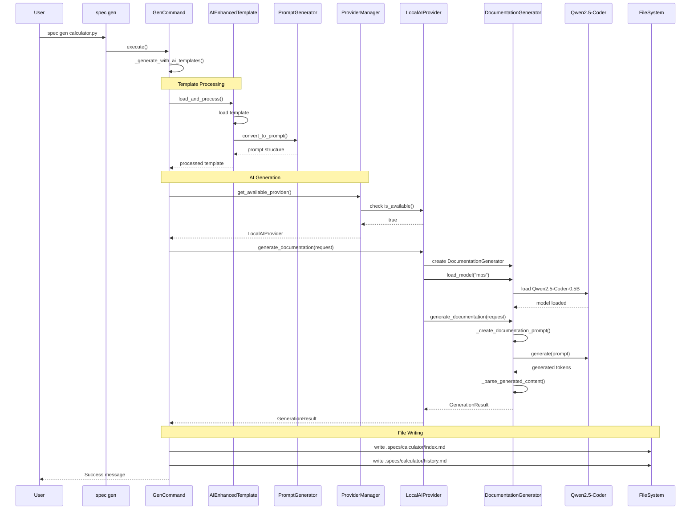
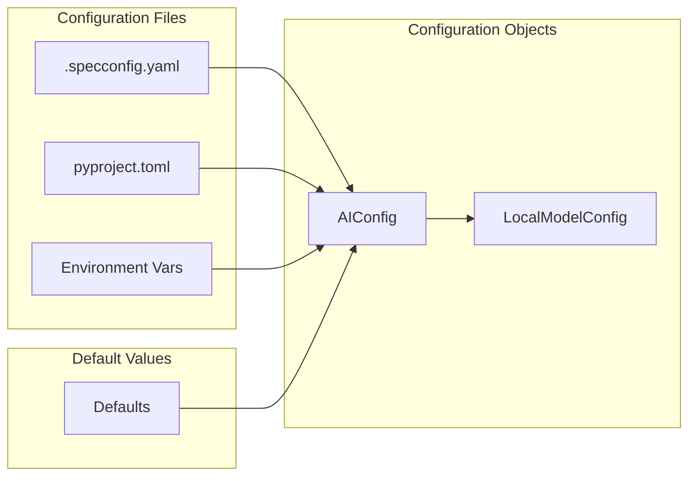
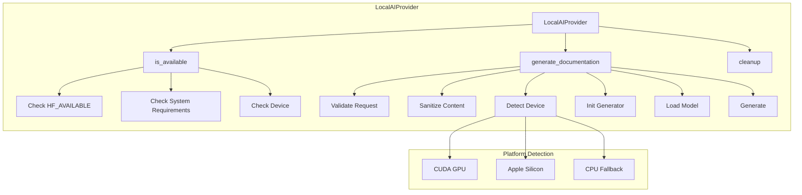
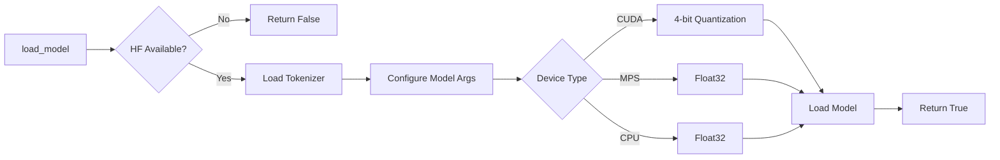

# AI System Architecture Documentation

## Table of Contents
1. [System Overview](#system-overview)
2. [Architecture Diagram](#architecture-diagram)
3. [Execution Flow](#execution-flow)
4. [Core Components](#core-components)
5. [Configuration System](#configuration-system)
6. [Template Integration](#template-integration)
7. [Provider System](#provider-system)
8. [Model Loading and Generation](#model-loading-and-generation)
9. [Troubleshooting History](#troubleshooting-history)
10. [Performance Considerations](#performance-considerations)

## System Overview

The spec-cli AI system is designed as an **AI-first documentation generation tool** with intelligent template fallback. It uses local AI models (primarily Qwen2.5-Coder) to analyze source code and generate comprehensive documentation.

### Key Principles
- **AI-First Approach**: AI generation is the primary method, with templates as enhancement/fallback
- **Local Model Focus**: Uses HuggingFace transformers for privacy and offline capability
- **Template-Driven Prompts**: Templates guide AI generation rather than being filled mechanically
- **Modular Provider System**: Extensible architecture for future cloud providers
- **Cross-Platform Support**: Works on Windows, macOS (including Apple Silicon), and Linux

## Architecture Diagram



## Execution Flow



## Core Components

### 1. Command Layer (`gen_command.py`)

**Purpose**: Entry point for the `spec gen` command, orchestrates the entire generation process.

**Key Methods**:
- `execute()` - Main entry point
- `_generate_with_ai_templates()` - AI generation with template enhancement
- `_finalize_ai_results()` - Converts AI results to file writes

**Flow Decision Points**:
1. Checks if AI is enabled in config
2. Falls back to traditional templates if AI fails
3. Handles both single files and directories

### 2. AI Generation Layer (`ai_generator.py`)

**Purpose**: Manages AI provider selection and generation workflow.

**Key Classes**:
- `AIDocumentationGenerator` - Wraps provider with generation logic
- Functions: `generate_with_ai_request()`, `generate_with_ai()`

**Key Features**:
- Provider-agnostic interface
- Structured workflow results
- Error handling with fallback signaling

### 3. Template System

#### `ai_enhanced.py`
- `AIEnhancedTemplate` class
- Loads templates and converts to AI prompts
- Preserves template structure for AI guidance

#### `prompt_generator.py`
- `PromptGenerator` class
- Analyzes templates to identify variables
- Creates structured prompts for AI

**Template Flow**:
```
.spectemplate → AIEnhancedTemplate → PromptGenerator → AI Prompt
                     ↓
                Template Variables (preserved as {{placeholders}})
```

### 4. Provider System

#### `manager.py`
- `ProviderManager` - Selects best available provider
- Provider availability checking
- Configuration-based selection

#### `local.py`
- `LocalAIProvider` - HuggingFace implementation
- Device detection (CUDA/MPS/CPU)
- Model lifecycle management
- Sanitization and validation

#### `generation.py`
- `DocumentationGenerator` - Core model operations
- Model loading with platform-specific optimizations
- Prompt creation and tokenization
- Inference execution
- Output parsing

## Configuration System



### Configuration Structure
```yaml
ai:
  enabled: true
  provider: local
  local:
    model_name: "Qwen/Qwen2.5-Coder-0.5B-Instruct"
    device: "auto"  # auto-detects cuda/mps/cpu
    max_tokens: 512
    temperature: 0.1
    use_4bit: false
    cache_enabled: true
```

## Template Integration

### How Templates Guide AI

1. **Template Loading**:
   - Templates contain markdown with `{{variable}}` placeholders
   - Variables represent content AI should generate

2. **Prompt Conversion**:
   - Template + Source Code → Structured AI Prompt
   - Original template preserved in prompt
   - AI instructed to fill placeholders

3. **Current Prompt Format** (Simplified):
```python
prompt = f"""Analyze this Python code and write documentation:

```python
{request.content[:1000]}
```

Write a markdown documentation that includes:
- Purpose and main functionality
- Key functions and classes
- Usage examples

Documentation:"""
```

### Template Variables (AI Should Fill)
- `{{purpose}}` - Main purpose of the code
- `{{overview}}` - High-level overview
- `{{dependencies}}` - External dependencies
- `{{api_interface}}` - Public API
- `{{example_usage}}` - Usage examples
- And 14 more...

## Provider System

### LocalAIProvider Architecture



### Provider Selection Logic
1. Check if AI is enabled in config
2. Check if provider type is "local"
3. Verify HuggingFace dependencies available
4. Check system requirements (PyTorch functional)
5. Return LocalAIProvider instance

## Model Loading and Generation

### Model Loading Process



### Generation Pipeline

1. **Prompt Creation** (`_create_documentation_prompt`):
   - Detects language from file extension
   - Formats code with syntax highlighting
   - Adds instructions based on template

2. **Tokenization**:
   - Max input length: 2048 tokens
   - Truncates if necessary
   - Moves to appropriate device

3. **Inference** (`_generate_with_model`):
   - Uses model.generate() with parameters:
     - max_new_tokens: 512
     - temperature: 0.1
     - do_sample: True (if temp > 0)

4. **Post-processing**:
   - Removes input tokens from output
   - Decodes generated tokens
   - Strips special tokens
   - Structures into index.md and history.md

## Troubleshooting History

### Issues Discovered and Resolved

1. **Dual AI System Problem**
   - **Issue**: PlaceholderAIProvider (old system) vs LocalAIProvider (new system)
   - **Resolution**: Eliminated old system, forced new AI system

2. **AI Dependencies as Optional**
   - **Issue**: Core AI deps (torch, transformers) were optional extras
   - **Resolution**: Made them required dependencies

3. **Empty Generation (Root Cause)**
   - **Issue**: Model generated only EOS token immediately
   - **Cause**: Complex template prompt (3993 chars) overwhelmed 0.5B model
   - **Resolution**: Simplified prompt format

4. **Model Loading Confusion**
   - **Issue**: Logs showed model not loading
   - **Cause**: Logger wasn't at debug level
   - **Resolution**: Model was loading correctly (1.1s on MPS)

### Key Debug Findings

```
Input tokens: 936 (complex prompt)
Output tokens: 1 (just EOS token)
Result: Empty content

After simplification:
Input tokens: ~200 (simple prompt)
Output tokens: 119
Result: 1420 chars of quality documentation
```

## Performance Considerations

### Current Performance Issues

1. **Debug Logging Overhead**
   - Multiple print statements per method
   - Synchronous I/O blocking execution
   - Should be removed for production

2. **Model Loading Time**
   - ~1.1 seconds on Apple Silicon (MPS)
   - Loaded fresh for each file
   - Could benefit from model caching

3. **Token Limits**
   - Currently using only 1000 chars of source
   - Model supports 32k context window
   - Could safely use 8k-14k tokens

### Optimization Opportunities

1. **Remove Debug Prints**: Significant performance gain
2. **Model Caching**: Keep model in memory between files
3. **Batch Processing**: Process multiple files together
4. **Increase Context**: Use more of the 32k window
5. **Async Generation**: Non-blocking AI inference

### Recommended Next Steps

1. **Remove all debug logging** (print statements)
2. **Increase source code limit** from 1000 to 8000+ chars
3. **Implement model caching** for multiple file processing
4. **Enhance prompt format** to better utilize templates
5. **Test larger models** (1B+) for complex template handling

## Summary

The AI system is now fully functional with:
- ✅ Complete AI pipeline working end-to-end
- ✅ Local model loading and inference
- ✅ Template-guided generation
- ✅ Cross-platform support
- ✅ Quality documentation output

The main limitation is the 0.5B model size, which requires simplified prompts. Upgrading to a larger model would enable full template complexity support.
